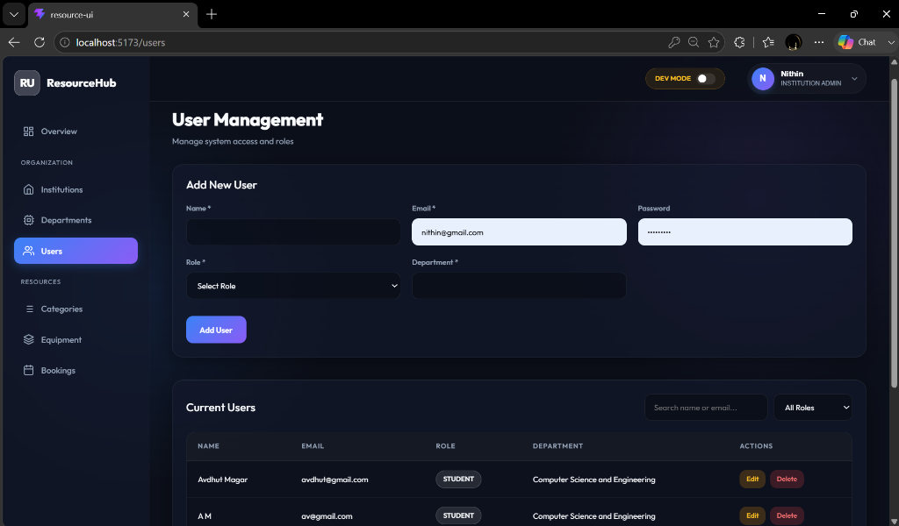
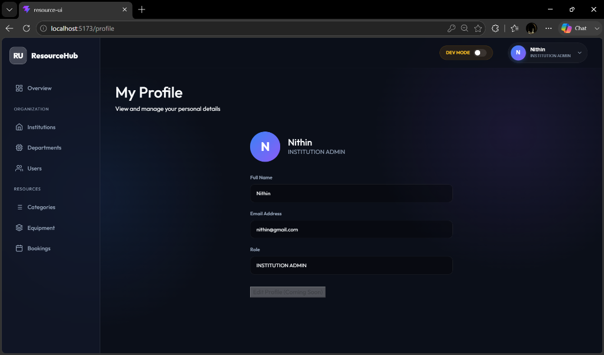
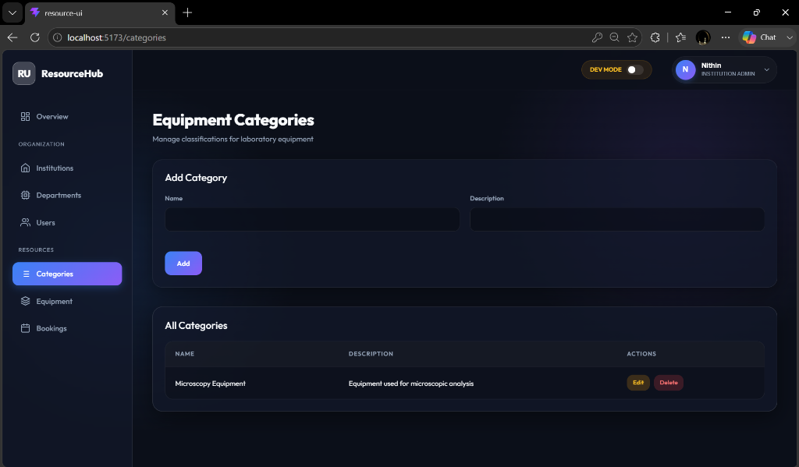
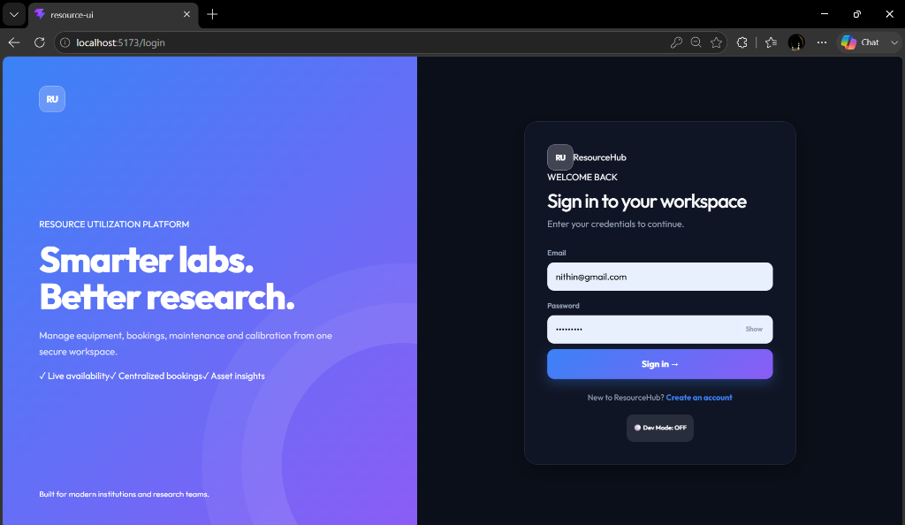
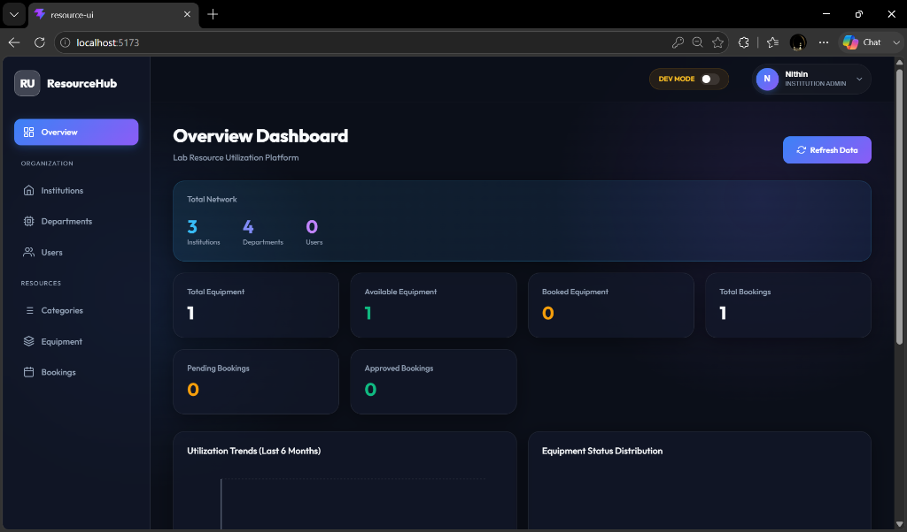
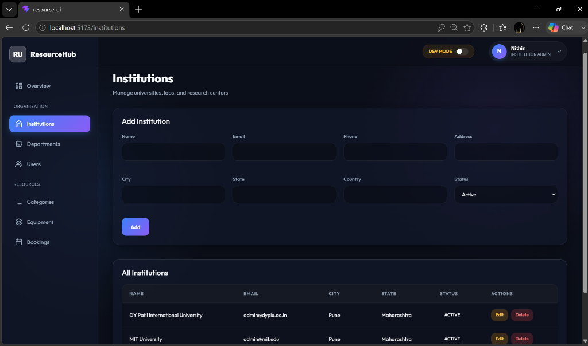
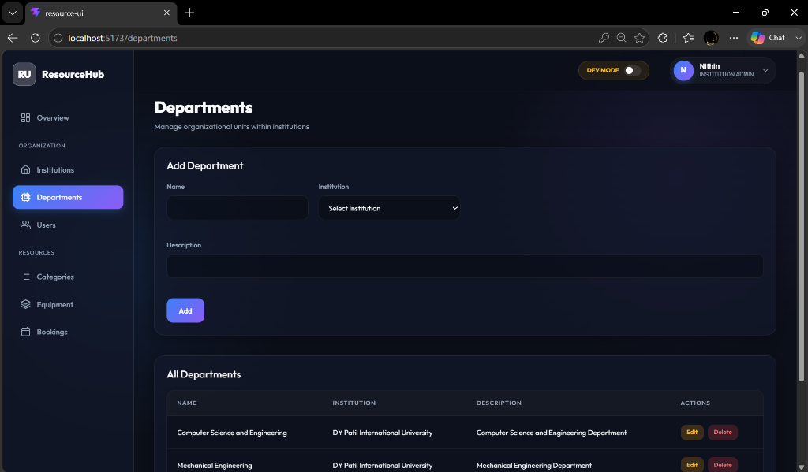
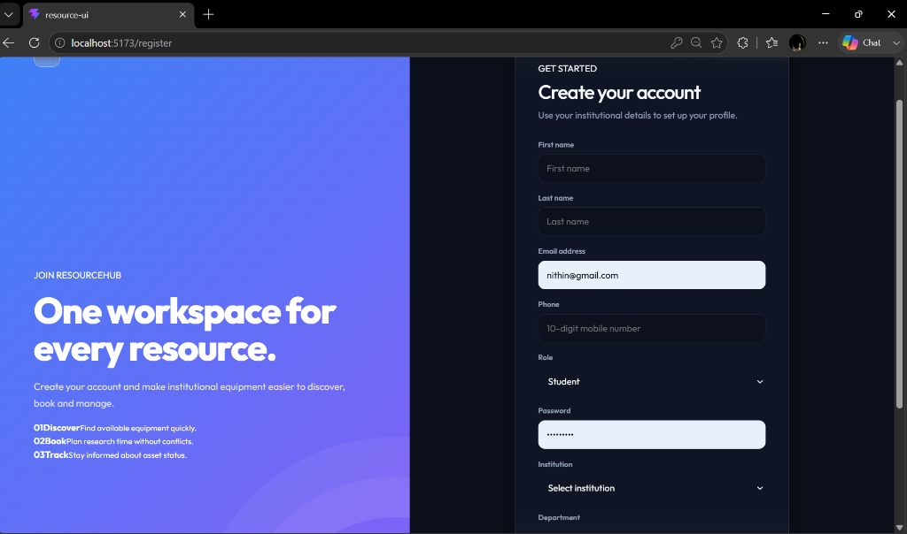

# Lab Resource Utilization Platform

## Infosys Springboard Virtual Internship Project

The **Lab Resource Utilization Platform** is a full-stack web application designed to manage laboratory resources, users, equipment, and equipment bookings efficiently.

The system provides a centralized platform where users can view available equipment and manage bookings, while administrators and lab managers can manage laboratory resources and related activities.

---

## Tech Stack

### Frontend
- React
- Vite
- JavaScript
- Bootstrap
- CSS
- React Router

### Backend
- Java
- Spring Boot
- Spring Data JPA
- Spring Security
- JWT Authentication
- Maven

### Database
- PostgreSQL

### Tools
- VS Code
- Git
- GitHub
- Swagger / OpenAPI

---

## Project Structure

Lab-Resource-Utilization-Platform/

    resource-ui/
        src/
        package.json
        vite.config.js

    resource-utilization/
        src/
        pom.xml

    README.md

`resource-ui` contains the React frontend.

`resource-utilization` contains the Spring Boot backend.

---

## Features Implemented

- React frontend setup
- Spring Boot backend setup
- PostgreSQL database integration
- Dashboard
- User Management
  - Add User
  - View Users
  - Edit User
  - Delete User
- Equipment Management
  - Add Equipment
  - View Equipment
  - Edit Equipment
  - Delete Equipment
- Booking Management
  - Create Booking
  - View Bookings
  - Edit Booking
  - Delete Booking
- User Registration
- User Login
- BCrypt password hashing
- JWT token generation
- Protected frontend routes
- User navbar
- Logout
- Swagger API documentation
- Frontend and backend integration

---

## Modules Under Development

- Complete JWT backend API protection
- Role-Based Access Control (RBAC)
- User Profile
- Booking conflict detection
- Booking approval/rejection workflow
- Maintenance and Calibration
- Resource Utilization Monitoring
- Notifications
- Analytics and Reports
- Testing and Security
- Deployment

---

## User Roles

The planned system supports:

### User
- View equipment
- Create bookings
- View own bookings
- Manage profile

### Lab Manager
- Manage equipment
- Manage bookings
- Approve or reject booking requests
- Manage maintenance and calibration

### Administrator
- Manage users and roles
- Manage equipment
- Manage bookings
- Monitor utilization
- Access analytics and reports

---

## Running the Backend

Navigate to the Spring Boot project:

    cd resource-utilization

Run:

    mvn spring-boot:run

The backend runs on:

    http://localhost:8080

---

## Running the Frontend

Navigate to the React project:

    cd resource-ui

Install dependencies:

    npm install

Start the development server:

    npm run dev

The frontend runs on:

    http://localhost:5173

---

## API Documentation

After starting the backend, Swagger/OpenAPI documentation can be accessed from the configured Swagger UI endpoint.

---

## Current Development Branch

    team3-Nithin

This branch contains frontend development, frontend-backend integration, authentication UI, protected routes, and related project work.

---

## Project Status

The core full-stack application is under active development.

Basic CRUD operations, frontend-backend integration, registration, login, JWT generation, and frontend route protection have been implemented.

Advanced security, role-based authorization, booking validation, maintenance, utilization monitoring, analytics, testing, and deployment are under development.

---

## Internship

**Program:** Infosys Springboard Internship  
**Project:** Lab Resource Utilization Platform

---

## Screenshots

### Settings

### Profile

### Bookings

### Categories

### Authentication (Login)

### Dashboard

### Institutions

### Departments

### Users

### Authentication (Registration)

