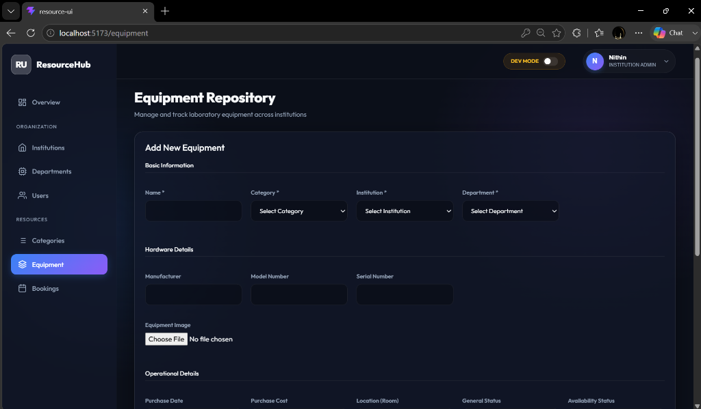

# Lab Resource Utilization Platform

## Infosys Springboard Virtual Internship Project

The **Lab Resource Utilization Platform** is a full-stack web application designed to manage laboratory resources, users, equipment, and equipment bookings efficiently.

The system provides a centralized platform where users can view available equipment and manage bookings, while administrators and lab managers can manage laboratory resources and related activities.

---

## Tech Stack

### Frontend
- React
- Vite
- JavaScript
- Bootstrap
- CSS
- React Router

### Backend
- Java
- Spring Boot
- Spring Data JPA
- Spring Security
- JWT Authentication
- Maven

### Database
- PostgreSQL

### Tools
- VS Code
- Git
- GitHub
- Swagger / OpenAPI

---

## Project Structure

Lab-Resource-Utilization-Platform/

    resource-ui/
        src/
        package.json
        vite.config.js

    resource-utilization/
        src/
        pom.xml

    README.md

`resource-ui` contains the React frontend.

`resource-utilization` contains the Spring Boot backend.

---

## Features Implemented

- React frontend setup
- Spring Boot backend setup
- PostgreSQL database integration
- Dashboard
- User Management
  - Add User
  - View Users
  - Edit User
  - Delete User
- Equipment Management
  - Add Equipment
  - View Equipment
  - Edit Equipment
  - Delete Equipment
- Booking Management
  - Create Booking
  - View Bookings
  - Edit Booking
  - Delete Booking
- User Registration
- User Login
- BCrypt password hashing
- JWT token generation
- Protected frontend routes
- User navbar
- Logout
- Swagger API documentation
- Frontend and backend integration

---

## Modules Under Development

- Complete JWT backend API protection
- Role-Based Access Control (RBAC)
- User Profile
- Booking conflict detection
- Booking approval/rejection workflow
- Maintenance and Calibration
- Resource Utilization Monitoring
- Notifications
- Analytics and Reports
- Testing and Security
- Deployment

---

## User Roles

The planned system supports:

### User
- View equipment
- Create bookings
- View own bookings
- Manage profile

### Lab Manager
- Manage equipment
- Manage bookings
- Approve or reject booking requests
- Manage maintenance and calibration

### Administrator
- Manage users and roles
- Manage equipment
- Manage bookings
- Monitor utilization
- Access analytics and reports

---

## Running the Backend

Navigate to the Spring Boot project:

    cd resource-utilization

Run:

    mvn spring-boot:run

The backend runs on:

    http://localhost:8080

---

## Running the Frontend

Navigate to the React project:

    cd resource-ui

Install dependencies:

    npm install

Start the development server:

    npm run dev

The frontend runs on:

    http://localhost:5173

---

## API Documentation

After starting the backend, Swagger/OpenAPI documentation can be accessed from the configured Swagger UI endpoint.

---

## Current Development Branch

    team3-Nithin

This branch contains frontend development, frontend-backend integration, authentication UI, protected routes, and related project work.

---

## Project Status

### What We've Done So Far
- **UI Modernization**: Upgraded the entire frontend to a professional, dark-themed, glassmorphic design system.
- **Organization & Role Architecture**: Established multi-tenant structural concepts including Institutions, Departments, and User Roles.
- **Backend Integration**: Successfully linked React UI endpoints to Spring Boot controllers (port 8081).
- **Security & Authentication**: Implemented fully functional JWT-based authentication, password encryption via BCrypt, and conditional protected route rendering.
- **API Mapping**: Implemented complete CRUD APIs in the backend with corresponding DTOs mapping to the frontend services.
- **Profile & Settings UI**: Built comprehensive user Profile and Settings layouts integrating modern toggles and profile actions.

### What's Next
- **Dynamic Booking Validation**: Implement server-side logic to detect booking conflicts and prevent duplicate reservations for the same equipment.
- **Role-Based Access Control (RBAC)**: Enforce strict backend rules (e.g. hasRole('ADMIN')) for sensitive endpoints and conditionally hide frontend menu items based on user permissions.
- **Real Analytics Integration**: Connect the Dashboard's statistical counters (Total Equipment, Booked Equipment, Pending Bookings) to real database aggregations.
- **Settings Connectivity**: Bind visual toggles in the Settings page to actual local browser storage and backend preferences APIs.
- **Approval Workflow**: Enable Lab Managers to approve or reject pending equipment bookings initiated by students.

---

## Internship

**Program:** Infosys Springboard Internship  
**Project:** Lab Resource Utilization Platform

---

## Screenshots

### 1. Dashboard

### 2. Institutions Management

### 3. Departments Management

### 4. User Management

### 5. Equipment Repository

### 6. Equipment Categories

### 7. Bookings Management

### 8. User Profile

### 9. Application Settings

### 10. Authentication (Login)

### 11. Authentication (Registration)
